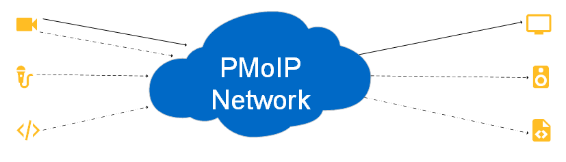

### Topics

#### What are we going to cover?

* The Fundamentals
* MoIP Essentials
* Architecture Guidance

#### What *aren't* we going to cover?

* Cisco, Arista, Mellanox, &lt;*insert switch vendor here*&gt; configuration
* Step-by-step for *your* network
* Consumer/last mile technology
* Much, much more

## The Fundamentals

### What is an MoIP network?

* A group or system of interconnected things
* Packet switched
* Probably wired
* Used internally, B2B, B2C/D2C, ad-hoc
* Uses Internet Protocol

### The Protocol Stack

```{.plantuml width=1600}
@startuml troubleshooting-model
!include https://raw.githubusercontent.com/plantuml-stdlib/C4-PlantUML/master/C4_Context.puml

HIDE_STEREOTYPE()
LAYOUT_LEFT_RIGHT()

UpdateElementStyle("system", $bgColor=#ffbd24, $fontColor=black)
UpdateBoundaryStyle("", $bgColor=#0069c6, $fontColor=white, $borderThickness=0)
UpdateRelStyle(black, black)
AddSystemTag("label", $bgColor=white, $fontColor=black, $borderThickness=0, $borderColor=white)
AddRelTag("label", $lineStyle=DottedLine())

System(osi, "OSI", $tags="label")
System(tcp, "TCP/IP", $tags="label")

Boundary(app, "Check the Application"){
  System(oapp, "Application")
  System(opres, "Presentation")
  System(osess, "Session")

  System(tapp, "Application")
}

Boundary(stack, "Check the Protocol Stack"){
  System(otrans, "Transport")
  System(onet, "Network")
  System(oll, "Logical Link")
  System(ttrans, "Transport")
  System(tinet, "Internet")
  System(tna, "Network Access")
}

Boundary(cable, "Check the Cable"){
  System(phy, "Physical")
}

Lay_R(osi, tcp)
Lay_R(opres, tapp)

Rel(osi, oapp, "", $tags="label")
Rel_(oapp, opres, "", "--")
Rel_(opres, osess, "", "--")
Rel_(osess, otrans, "", "--")
Rel_(otrans, onet, "", "--")
Rel_(onet, oll, "", "--")
Rel_(oll, phy, "", "--")

Rel(tcp, tapp, "", $tags="label")
Rel_(tapp, ttrans, "", "--")
Rel_(ttrans, tinet, "", "--")
Rel_(tinet, tna, "", "--")
Rel_(tna, phy, "", "--")

@enduml
```

::: notes

Physical is not technically part of the TCP/IP model.
LL/Network Access handles hop to hop delivery.
Network/Internet handles end to end delivery.
Transport handles service to service delivery.

What does that mean?
Think about sending a card to your mom across the country.
The physical layer are the roads, sea lanes, and air routes that connect your house to your mother's.
The LL/network access layer gets your envelope from the mail box to the local post office, from the post office to the distribution center, from the distribution center to the….
You get the idea.
The network/Internet layer makes sure the postal service knows the letter is going from you to your mom.
The transport layer guarantees that the card makes it into your mom's hands just in time for Mother's Day.

:::

### Physical Layer

* Copper
  * 1, 2.5, 5, & 10 Gbit
  * Higher bit rate = higher CAT cable
  * Higher bit rate = higher termination quality
* Fiber
  * 10, 25, 40, 100 Gbit and up
  * Select optics and cable carefully
  *

::: notes

25 and 40 Gbit copper standardized, but not marketed.

:::

### Logical Link/Network Access

:::::::::::::: {.columns}
::: {.column width="80%"}

* Frames
* Rules for using the physical layer
  * CSMA/CD vs CSMA/CA vs Token Passing vs FDM
* Error detection & correction
* ARP: MAC address ↔ IP address
* MTU: largest frame that can be sent
  * Original Ethernet: 1,500 bytes
  * Jumbo Frames: 1,501-9,000 bytes
  * Super Jumbo Frames: 9,001-64,000 bytes

:::
::: {.column width="20%"}

```{.plantuml height=1000}
@startuml ip-mac-addresses
!define CiscoPuml https://raw.githubusercontent.com/Julien-cpsn/plantuml-cisco-icons/master
!include CiscoPuml/Icons/all.puml

!$ICONURL = "https://raw.githubusercontent.com/tupadr3/plantuml-icon-font-sprites/v3.0.0/icons"
!include $ICONURL/common.puml
!include $ICONURL/font-awesome-6/video.puml
!include $ICONURL/font-awesome-6/microphone.puml
!include $ICONURL/font-awesome-6/tv.puml

<style>
nwdiagDiagram {
  network {
    BackGroundColor "red"
  }
  server {
    BackGroundColor "#0069c6"
    FontColor "white"
  }
  arrow {
    FontSize 16
  }
}
</style>

nwdiag {
  Spine [shape="cloud"];
  Spine -- rtr;
  network red{
    rtr [address = "192.0.2.1, 00‑00‑5E‑00‑53‑00", description = "<color:#ffbd24><$layer_3_switch>\nRouter"];
    cam [address = "192.0.2.5, 00‑00‑5E‑00‑53‑AF", description = "<color:#ffbd24><$video>\nCamera"];
    mon [address = "192.0.2.6, 00‑00‑5E‑00‑53‑99", description = "<color:#ffbd24><$tv>\nMonitor"]
  }
}
@enduml
```

:::
::::::::::::::

::: notes

<!-- vale write-good.TooWordy["Multiple"] = NO -->
Error detection primarily in the form of parity bits or checksums.
Collision Sense Multiple Access/Collision Detection (wired) compared to Collision Avoidance (wireless).
<!-- vale write-good.TooWordy["Multiple"] = YES -->

:::

### Network/Internet

<!-- TODO: Say something more about RFC 1918 -->
* Packets
* RFC 1918
* Control Plane vs Data Plane
* Buffer management affects jitter
* Encapsulation
* Routing
  * Link State vs Distance/Path Vector
  * OSPF vs BGP

```{.mermaid}
packet-beta
0-3: "Version"
4-7: "IHL"
8-13: "DSCP"
14-15: "ECN"
16-31: "Total Length"
32-47: "Identification"
48-50: "Flags"
51-63: "Fragment Offset"
64-71: "Time to Live"
72-79: "Protocol"
80-95: "Header Checksum"
96-127: "Source Address"
128-159: "Destination Address"
```

::: notes

Link state protocols advertise the condition of every connection on a router to all routers in the domain.
Link state protocols converge quickly but are resource intensive.
Distance vector protocols share how far a destination is from a router and what the next hop is only with immediate neighbors.
Path vector share a bit more information.
DV protocols converge slowly but need less horsepower.
In other words, DV protocols scale better.

:::

### Subnets

* A logical division of an IP network
* Why?
  * Classical: Limit broadcast domain
  * Now: Enable the control plane
* Same most-significant bits = same subnet
* Original style: Class A through E
* Now: Classless Inter-Domain Routing (CIDR)
* VLAN: Logically creating subnets with shared physical infrastructure

+-----------------+-------------------------------------------------------+---------------------------------------------------------+
|                 | /24                                                   | /26                                                     |
+-----------------+---------------------------------------+---------------+---------------------------------------+-----------------+
|                 | Binary                                | Decimal       | Binary                                | Decimal         |
+=================+=======================================+===============+=======================================+=================+
| Address         | `11000000.00000000.00000010.10000010` | 192.0.2.130   | `11000000.00000000.00000010.10000010` | 192.0.2.130     |
+-----------------+---------------------------------------+---------------+---------------------------------------+-----------------+
| Subnet Mask     | `11111111.11111111.11111111.00000000` | 255.255.255.0 | `11111111.11111111.11111111.11000000` | 255.255.255.192 |
+-----------------+---------------------------------------+---------------+---------------------------------------+-----------------+
| Network Prefix  | `11000000.00000000.00000010.00000000` | 192.0.2.0     | `11000000.00000000.00000010.10000000` | 192.0.2.128     |
+-----------------+---------------------------------------+---------------+---------------------------------------+-----------------+
| Host Identifier | `00000000.00000000.00000000.10000010` | 0.0.0.130     | `00000000.00000000.00000000.00000010` | 0.0.0.2         |
+-----------------+---------------------------------------+---------------+---------------------------------------+-----------------+

### Transport

:::::::::::::: {.columns}
::: {.column width="80%"}

* Segments
* Logical communication between processes
* *Your* letter carrier
* Identified by port numbers
  * 1-1023: "Well known" services
  * 1024-65535: Everything else
* Transmission Control Protocol (TCP)
  * Connection-oriented
  * Error checking
  * Reliable delivery
  * Congestion control
  * Three way handshake (SYN, SYN+ACK, ACK)
  * Ordered
  * Slow
* User Datagram Protocol (UDP)
  * Connectionless
  * Error checking
  * Atomic
  * Lower overhead (smaller header)
  * Only identified by destination IP + Port

:::
::: {.column width="20%"}

```{.plantuml}
@startuml tcp-udp-compare
!pragma teoz true

group TCP
  autonumber
  Client ->(20) Server: SYN
  Server ->(20) Client: SYN + ACK
  Client ->(20) Server: ACK
  autonumber stop
end

group UDP
  Client ->(20) Server: Data
  Server -->(20) Client: Response?
end

@enduml
```

:::
::::::::::::::

### DNS

* Numbers are hard for people, names are better
* Divided into **zones**
* Authoritative name servers "own" a zone (SOA)
* Root name servers resolve TLDs
* Fully Qualified Domain Name (FQDN).

### Record Types

* **A/AAAA:** Name &#8594; IP Address
* **PTR:** IP Address &#8594; Name; DNS-SD
* **CNAME:** "Pretty" Name &#8594; "Real" Name
* **SRV:** Service location
* **TXT:** ~~Human~~ Machine-readable text

### DHCP

:::::::::::::: {.columns}
::: {.column width="50%"}

* Automated IP stack configuration
* Dynamic, automatic, & manual modes
* Client requests a *lease*, automatically renews
* Release & renew manually for troubleshooting
* *Options* let you configure more than just address

:::
::: {.column width="50%"}


:::
::::::::::::::

### Firewalls

:::::::::::::: {.columns}
::: {.column width="50%"}

* Monitors & controls incoming & outgoing network traffic
* Often between trusted & untrusted networks
* Packet filter/stateless, Connection tracking/stateful, application
* DMZ allows select public connections to some hosts

:::
::: {.column width="50%"}


:::
::::::::::::::

::: notes

<!-- vale proselint.But = NO -->
Stateless firewalls aren't frequently used in modern systems.
But you will see their mechanisms used for provide other network features.
For example, extended Berkeley Packet Filters (eBPF) safely extends kernel functionality.
<!-- vale proselint.But = YES -->

:::

### NAT

:::::::::::::: {.columns}
::: {.column width="50%"}

* A way to map one address space into another
* Often RFC1918 to/from public
* Basic/one-to-one: Just rewrite addresses
* One-to-many: Rewrite addresses and port numbers
* Watch out for CGNAT and double NAT

:::
::: {.column width="50%"}

![Network address translation between a private network and the Internet[^credit-nat]](https://upload.wikimedia.org/wikipedia/commons/c/c7/NAT_Concept-en.svg)

[^credit-nat]: Michel Bakni, [CC BY-SA 4.0](https://creativecommons.org/licenses/by-sa/4.0), via Wikimedia Commons

:::
::::::::::::::

## MoIP Essentials

### ST 2110 in 60 Seconds

:::::::::::::: {.columns}
::: {.column width="50%"}

* Real-time Transport Protocol (RTP) carries essence
  * UDP
  * Multicast
* Session Description Protocol (SDP) describes essence
* Precision Time Protocol (PTPv2) synchronizes essence
* Every essence is a separate flow
* Leaky bucket model for buffers

:::
::: {.column width="50%"}



:::
::::::::::::::

### Network Architectures

:::::::::::::: {.columns}
::: {.column width="50%"}

#### Multi Tier

```{.plantuml}
@startuml multi-tier-arch
!include https://raw.githubusercontent.com/plantuml-stdlib/C4-PlantUML/master/C4_Context.puml
!define CiscoPuml https://raw.githubusercontent.com/Julien-cpsn/plantuml-cisco-icons/master
!include CiscoPuml/Icons/all.puml

UpdateElementStyle("system", $bgColor=white, $fontColor=#0069c6, $borderColor=white)
UpdateRelStyle(black, black)

HIDE_STEREOTYPE()
LAYOUT_TOP_DOWN()

System(core, "Core Switch", $sprite=layer_3_switch)
System(distr1, "Distribution Switch", $sprite=layer_3_switch)
System(distr2, "Distribution Switch", $sprite=layer_3_switch)
System(acc1, "Access/TOR Switch", $sprite=workgroup_switch)
System(acc2, "Access/TOR Switch", $sprite=workgroup_switch)

BiRel(core, distr1, "")
BiRel(core, distr2, "")
BiRel(distr1, acc1, "")
BiRel(distr2, acc2, "")
@enduml
```

:::
::: {.column width="50%"}

#### Spine-Leaf

```{.plantuml}
@startuml spine-leaf-arch
!include https://raw.githubusercontent.com/plantuml-stdlib/C4-PlantUML/master/C4_Context.puml
!define CiscoPuml https://raw.githubusercontent.com/Julien-cpsn/plantuml-cisco-icons/master
!include CiscoPuml/Icons/all.puml

UpdateElementStyle("system", $bgColor=white, $fontColor=#0069c6, $borderColor=white)
UpdateRelStyle(black, black)

HIDE_STEREOTYPE()
LAYOUT_TOP_DOWN()

System(spine1, "Spine 1", $sprite=layer_3_switch)
System(spine2, "Spine 2", $sprite=layer_3_switch)
System(leaf1, "Leaf 1", $sprite=layer_3_switch)
System(leaf2, "Leaf 2", $sprite=layer_3_switch)
System(leaf3, "Leaf 3", $sprite=layer_3_switch)

BiRel(spine1, leaf1, "")
BiRel(spine2, leaf1, "")
BiRel(spine1, leaf2, "")
BiRel(spine2, leaf2, "")
BiRel(spine1, leaf3, "")
BiRel(spine2, leaf3, "")
@enduml
```

:::
::::::::::::::

<!-- vale write-good.Passive = NO -->
### Roses Are Red, Redundant Paths Are Blue
<!-- vale write-good.Passive = YES -->

```{.plantuml}
@startuml red-blue
!include https://raw.githubusercontent.com/plantuml-stdlib/C4-PlantUML/master/C4_Context.puml
!define CiscoPuml https://raw.githubusercontent.com/Julien-cpsn/plantuml-cisco-icons/master
!include CiscoPuml/Icons/all.puml

!$ICONURL = "https://raw.githubusercontent.com/tupadr3/plantuml-icon-font-sprites/v3.0.0/icons"
!include $ICONURL/common.puml
!include $ICONURL/font-awesome-6/video.puml
!include $ICONURL/font-awesome-6/microphone.puml
!include $ICONURL/font-awesome-6/tv.puml

UpdateElementStyle("system", $bgColor=white, $fontColor=#ffbd24, $borderColor=white)
UpdateRelStyle(black, black)
AddElementTag("red", $fontColor=red)
AddElementTag("blue", $fontColor=#0069c6)
AddElementTag("purple", $fontColor=purple)
AddRelTag("red", $lineColor=red)
AddRelTag("blue", $lineColor=#0069c6)
AddRelTag("purple", $lineColor=purple)

HIDE_STEREOTYPE()
LAYOUT_TOP_DOWN()

System(rspine1, "", $sprite=layer_3_switch, $tags="red")
System(rspine2, "", $sprite=layer_3_switch, $tags="red")
System(rleaf1, "", $sprite=layer_3_switch, $tags="red")
System(rleaf2, "", $sprite=layer_3_switch, $tags="red")
System(rleaf3, "", $sprite=layer_3_switch, $tags="red")

System(bspine1, "", $sprite=layer_3_switch, $tags="blue")
System(bspine2, "", $sprite=layer_3_switch, $tags="blue")
System(bleaf1, "", $sprite=layer_3_switch, $tags="blue")
System(bleaf2, "", $sprite=layer_3_switch, $tags="blue")
System(bleaf3, "", $sprite=layer_3_switch, $tags="blue")

System(pleaf1, "", $sprite=layer_3_switch, $tags="purple")

System(camera, "", $sprite=video)
System(mic, "", $sprite=microphone)
System(tv, "", $sprite=tv)

Lay_R(rspine1, rspine2)
Lay_R(rspine2, bspine1)
Lay_R(bspine1, bspine2)
Lay_R(rleaf1, rleaf2)
Lay_R(rleaf2, rleaf3)
Lay_R(rleaf3, pleaf1)
Lay_R(pleaf1, bleaf1)
Lay_R(bleaf1, bleaf2)
Lay_R(bleaf2, bleaf3)
Lay_D(mic, camera)
Lay_D(mic, tv)
BiRel(rspine1, rleaf1, "", $tags="red")
BiRel(rspine2, rleaf1, "", $tags="red")
BiRel(rspine1, rleaf2, "", $tags="red")
BiRel(rspine2, rleaf2, "", $tags="red")
BiRel(rspine1, rleaf3, "", $tags="red")
BiRel(rspine2, rleaf3, "", $tags="red")

BiRel(bspine1, bleaf1, "", $tags="blue")
BiRel(bspine2, bleaf1, "", $tags="blue")
BiRel(bspine1, bleaf2, "", $tags="blue")
BiRel(bspine2, bleaf2, "", $tags="blue")
BiRel(bspine1, bleaf3, "", $tags="blue")
BiRel(bspine2, bleaf3, "", $tags="blue")

BiRel(rspine1, pleaf1, "", $tags="purple")
BiRel(rspine2, pleaf1, "", $tags="purple")
BiRel(bspine1, pleaf1, "", $tags="purple")
BiRel(bspine2, pleaf1, "", $tags="purple")

Rel_U(camera, rleaf1, "", $tags="red")
Rel_U(camera, bleaf1, "", $tags="blue")

Rel_U(mic, pleaf1, "", $tags="purple")

Rel(rleaf2, tv, "", $tags="red")
Rel(bleaf2, tv, "", $tags="blue")

@enduml
```

### VLAN & VXLAN

### IGMP

### Software Defined Networking

## Architecture Guidance

### Documentation

* Use the right tool for the job
* Use DCIM & IPAM like [NetBox](https://netbox.dev/)
* Use a consistent, straightforward visual language like the
  [C4 Model](https://c4model.com/)

::: notes

Spreadsheets aren't databases.

:::

### Define Requirements

* Hitless means different things to different people
* Increased redundancy reduces reliability

### Compare Options

<!-- vale proselint.Very = NO -->
<!-- vale write-good.Weasel = NO -->

+----------------------+-------------------+-----------+-----------+----------------------------+
|  *Feature*           | *OISM*            | *Layer 3* | *SDN*     | *Layer 2*                  |
+:=====================+:==================+:==========+:==========+:===========================+
| **Key Technologies** | OISM, EVPN, VXLAN | BGP       | Vendor X  | PIM-SM                     |
+----------------------+-------------------+-----------+-----------+----------------------------+
| **Redundancy**       | MLAG, LACP        |           | 2022-7    | 2022-7 with crafted routes |
+----------------------+-------------------+-----------+-----------+----------------------------+
| **Multi-site**       | Good              | Good      | Poor      | Poor                       |
+----------------------+-------------------+-----------+-----------+----------------------------+
| **Scalability**      | Good              | Good      | Excellent | Poor                       |
+----------------------+-------------------+-----------+-----------+----------------------------+
| **Vendor Lock In**   | Low               | Very Low  | Moderate  | Very Low                   |
+----------------------+-------------------+-----------+-----------+----------------------------+
| **Route Time**       | Fast              | Fast      | Faster    | Fast-ish                   |
+----------------------+-------------------+-----------+-----------+----------------------------+
| **Fail-over Time**   | &lt; 10 ms        |           | Hitless   |                            |
+----------------------+-------------------+-----------+-----------+----------------------------+
| **Tally Time**       | Slow              | Slow      | Faster    | Slow                       |
+----------------------+-------------------+-----------+-----------+----------------------------+
| **Clean Switching**  | Probable          | Probable  | Yes       | Probable                   |
+----------------------+-------------------+-----------+-----------+----------------------------+
| **Bandwidth Aware**  | No                | No        | Yes       | No                         |
+----------------------+-------------------+-----------+-----------+----------------------------+
| **Video Support**    | Fair              | Fair      | Excellent | Poor                       |
+----------------------+-------------------+-----------+-----------+----------------------------+

<!-- vale proselint.Very = YES -->
<!-- vale write-good.Weasel = YES -->

::: notes

This is part of the analysis SiriusXM used to rank network architecture options.

:::
